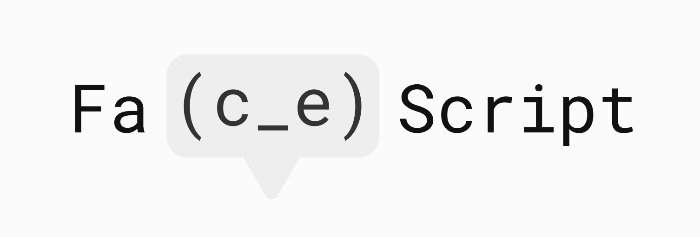

# Fa(c_e)Script


Fa(c_e)Script（フェイススクリプト）は、顔文字を並べてコードを記述するプログラミング言語です。

- [実行までの手順](#実行までの手順)
- [1. 値](#1-値)
- [2. 演算子](#2-演算子)
- [3. 命令文](#3-命令文)
- [4. 表示文](#4-表示文)
- [5. 条件分岐文](#5-条件分岐文)
- [6. 繰り返し文](#6-繰り返し文)
- [7. 変数](#7-変数)
- [8. エラー](#8-エラー)

## 実行までの手順
**Fa(c_e)Scriptを実行するには、Node.jsの実行環境が必要です。**

### 1. ディレクトリを作成
好きな名前でディレクトリを作成します。その中に、リポジトリ内のJavaScriptファイル`faces.js`と、
好きな名前の空のJavaScriptファイル`<fileName>.js`、ここでは例として`sample.js`を置きます。

### 2. Fa(c_e)Scriptファイルを作成
好きな名前のFa(c_e)Scriptファイル`<fileName>.faces`を作成します。拡張子は、`.faces`です。
ここでは例として`sample.faces`とします。このファイルは先ほどのディレクトリ内に置きます。

### 3. JavaScriptファイルを記述
`sample.js`を記述します。`faces.js`をモジュールとして読み込み、`sample.faces`を実行するコードです。

`sample.js`:
```
let faces = require("./faces");

faces("./sample.faces");
```

ここまで完了したら、Fa(c_e)Scriptを実行する準備が整いました。
`sample.faces`内にFa(c_e)Scriptを記述して、Node.jsで`sample.js`を実行します。

## 1. 値
値は、`(o_o)`を1、`(-_-)`を0とする二進数で表します。

例:
```
(-_-)
(o_o)
(o_o)(o_o)
(o_o)(-_-)(-_-)(o_o)
```
```
-> 0を表します。
-> 1を表します。
-> 3を表します。
-> 9を表します。
```

`⊂(¯^¯)⊃`は複数の値を並べて記述するときに使用します。

例:
```
(-_-)⊂(¯^¯)⊃(o_o)
(o_o)(o_o)⊂(¯^¯)⊃(o_o)
(o_o)⊂(¯^¯)⊃(o_o)(-_-)⊂(¯^¯)⊃(o_o)(o_o)
```
```
-> 0,1を表します。
-> 3,1を表します。
-> 1,2,3を表します。
```

## 2. 演算子
演算子は`⊃`を（顔から見て）左手とする顔文字です。
演算子を値の直前に記述することで、その値を演算します。

`('^;)⊃`は正負反転する演算子、`(^ω^)⊃`は加算する演算子です。

例:
```
('^;)⊃(o_o)(o_o)
(^ω^)⊃(o_o)⊂(¯^¯)⊃(o_o)(-_-)
```
```
-> -3を表します。
-> 1+2、すなわち3を表します。
```

演算子が複数重なっている場合、
1. 値と演算子の列を後ろから順に
2. 演算子があれば演算する
3. 後ろに戻って(1.)から

これらを繰り返して演算します。

例:
```
(^ω^)⊃(o_o)⊂(¯^¯)⊃(^ω^)⊃(o_o)(-_-)⊂(¯^¯)⊃(o_o)(o_o)
```
```
-> 後ろから見て2+3=5、後ろに戻ってから見て1+5、すなわち6を表します。
```

### 2.1. 四則演算子
加減乗除の演算子はそれぞれ`(^ω^)⊃`、`(-ε-)⊃`、`(>ω<)⊃`、`(TεT)⊃`です。

例:
```
(^ω^)⊃(o_o)(o_o)⊂(¯^¯)⊃(o_o)(-_-)
(-ε-)⊃(o_o)(o_o)⊂(¯^¯)⊃(o_o)(-_-)
(>ω<)⊃(o_o)(o_o)⊂(¯^¯)⊃(o_o)(-_-)
(TεT)⊃(o_o)(o_o)⊂(¯^¯)⊃(o_o)(-_-)
```
```
-> 3+2、すなわち5を表します。
-> 3-2、すなわち1を表します。
-> 3*2、すなわち6を表します。
-> 3/1、すなわち1.5を表します。
```

### 2.2. 比較演算子
数値を比較する演算子`=`、`≥`、`≤`、`>`、`<`はそれぞれ`(>_<)⊃`、`(>_O)⊃`、`(O_<)⊃`、`(>xO)⊃`、`(Ox<)⊃`です。
比較の結果が真なら1、偽なら0と演算されます。

例:
```
(>_<)⊃(o_o)⊂(¯^¯)⊃(o_o)
(>_<)⊃(o_o)⊂(¯^¯)⊃(-_-)
(>_O)⊃(o_o)(o_o)⊂(¯^¯)⊃(o_o)
```
```
-> 1=1は真なので1を表します。
-> 1=0は偽なので0を表します。
-> 3≥1は真なので1を表します。
```

### 2.3. その他の演算子
| 演算子 | 被演算子数 | 演算 |
| :--- | :---: | :--- |
| `('^;)⊃` | 1 | 値の正負を反転します。 |
| `(O∇O)⊃` | 1 | 値を絶対値にします。 |
| `(.^.)⊃` | 1 | 値が1以上なら0、0以下なら1にします。 |
| `(◕-◕)⊃` | 1 | 値をUnicodeの符号とする文字にします。 |
| `(>◡<)⊃` | 2 | 値を結合します。 |

## 3. 命令文
`⅃`を左手とする顔文字は命令文を表します。
命令文を表す顔文字の直後に引数（命令文への入力となる値）を記述します。
`L(-.<)`は命令文の終了を表します。

## 4. 表示文
`('O')⅃`は、引数を表示する命令文です。
```
('O')⅃ <表示する値> L(-.<)
```
例:
```
('O')⅃(o_o)L(-.<)
('O')⅃(o_o)(o_o)⊂(¯^¯)⊃(o_o)L(-.<)
```
```
-> 1と表示します。
-> 3 1と表示します。
```

## 5. 条件分岐文
`(¯^°)⅃`は、1つ目の引数が1以上かどうかによって、その後の命令文を実行するか決定します。
実行するか決定する命令文の数は、2つ目の引数で指定します。
```
(¯^°)⅃ <真偽> ⊂(¯^¯)⊃ <命令文の数> L(-.<)
...<命令文>
```

例:
```
(¯^°)⅃(o_o)⊂(¯^¯)⊃(o_o)L(-.<)
('O')⅃(-_-)L(-.<)
```
```
-> 1つ目の引数は1なので、その後の1つの命令文を実行して、0と表示します。
```

```
(¯^°)⅃(>_<)⊃(o_o)⊂(¯^¯)⊃(o_o)⊂(¯^¯)⊃(o_o)(-_-)L(-.<)
('O')⅃(-_-)L(-.<)
('O')⅃(o_o)L(-.<)
('O')⅃(o_o)(-_-)L(-.<)
```
```
-> 1つ目の引数は1（1=1は真）なので、その後の2つの命令文を実行して、0、1と順に表示します。
-> 条件分岐文では2個先まで命令文が指定されているので、3個先の命令文は影響されず、2と表示します。
```

```
(¯^°)⅃(>_<)⊃(o_o)⊂(¯^¯)⊃(-_-)⊂(¯^¯)⊃(o_o)(-_-)L(-.<)
('O')⅃(-_-)L(-.<)
('O')⅃(o_o)L(-.<)
('O')⅃(o_o)(-_-)L(-.<)
```
```
-> 1つ目の引数は0（1=0は偽）なので、その後の2つの命令文を実行しません。
-> 条件分岐文では2個先まで命令文が指定されているので、3個先の命令文は影響されず、2と表示します。
```

## 6. 繰り返し文
`(°д°)⅃`は、その後の命令文を1つ目の引数で指定された回数繰り返して実行します。
繰り返して実行する命令文の数は、2つ目の引数で指定します。
```
(°д°)⅃ <繰り返す回数> ⊂(¯^¯)⊃ <命令文の数> L(-.<)
...<命令文>
```

例:
```
(°д°)⅃(o_o)(o_o)⊂(¯^¯)⊃(o_o)L(-.<)
('O')⅃(-_-)L(-.<)
```
```
-> 0と3回繰り返して表示されます。
```

```
(°д°)⅃(o_o)(o_o)⊂(¯^¯)⊃(o_o)(-_-)L(-.<)
('O')⅃(-_-)L(-.<)
('O')⅃(o_o)L(-.<)
('O')⅃(o_o)(-_-)L(-.<)
```
```
-> 0と表示した後、1表示するのが3回繰り返して実行されます。
-> 繰り返し文では2個先まで命令文が指定されているので、3個先の命令文は影響されず、2と表示します。
```

## 7. 変数
### 7.1. 変数の宣言
`(°∇°)⅃`は、変数の宣言と値の代入をする命令文です。
1つ目の引数は宣言する変数名、2つ目の引数は代入する値を指定します。
```
(°∇°)⅃ <変数名> ⊂(¯^¯)⊃ <代入する値> L(-.<)
```

演算子`('ω')⊃`は、値を変数名とする変数にします。

例:
```
('ω')⊃(-_-)
```
```
-> 変数0を表します。
```

```
(°∇°)⅃(-_-)⊂(¯^¯)⊃(o_o)(o_o)(o_o)L(-.<)
('O')⅃('ω')⊃(-_-)L(-.<)
```
```
-> 変数0を宣言して7を代入します。
-> 変数0、すなわち7を表示します。
```

### 7.2.　変数の再代入
`('∇')⅃`は、変数の再代入をする命令文です。
1つ目の引数は再代入する変数名、2つ目の引数は代入する値を指定します。
```
('∇')⅃ <変数名> ⊂(¯^¯)⊃ <代入する値> L(-.<)
```

例:
```
(°∇°)⅃(-_-)⊂(¯^¯)⊃(o_o)(o_o)(o_o)L(-.<)
('O')⅃('ω')⊃(-_-)L(-.<)
(°∇°)⅃(-_-)⊂(¯^¯)⊃(o_o)(o_o)L(-.<)
('O')⅃('ω')⊃(-_-)L(-.<)
```
```
-> 変数0を宣言して7を代入します。
-> 変数0、すなわち7を表示します。
-> 変数0に3を再代入します。
-> 変数0、すなわち3を表示します。
```

## 8. エラー
ソースコードが実行不可能と判断されると、エラーコードを表示して、処理を中断します。

### 8.1. エラーコード
エラーコードは赤色の文字で表示される顔文字です。

| エラーコード | エラーの内容 |
| :--- | :--- |
| `(#ˋзˊ)੭` | Fa(c_e)Scriptの文法に反した記述があります。 |
| `(;°~°)∂` | 演算子の指定に誤りがあります。 |
| `(ˊ•ω•)৴` | 命令文の引数の指定に誤りがあります。 |